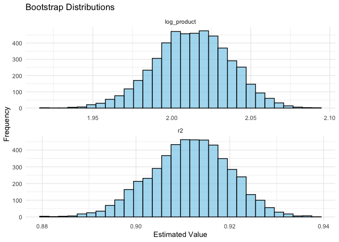
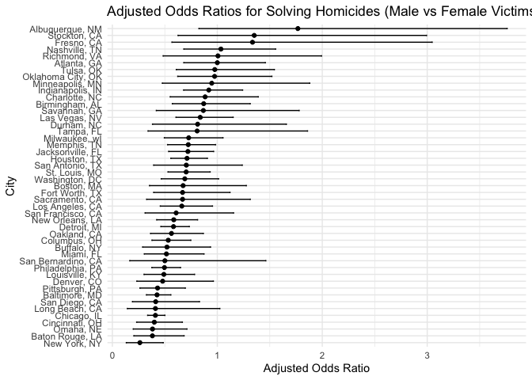
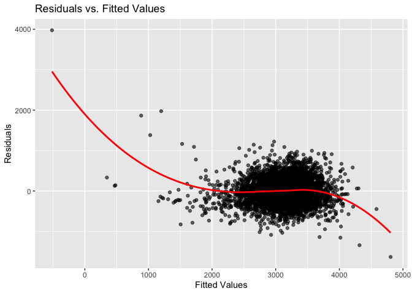

p8105_hw6_sd3730
================
Stacey Dai
2024-12-02

# Problem 1

Load necessary packages for problem 1.

``` r
library(tidyverse)
library(rnoaa)
library(broom)
```

Clean and prepare the noaa dataset for analysis.

``` r
weather_df = 
  rnoaa::meteo_pull_monitors(
    c("USW00094728"),
    var = c("PRCP", "TMIN", "TMAX"), 
    date_min = "2017-01-01",
    date_max = "2017-12-31"
  ) |>
  mutate(
    name = recode(id, USW00094728 = "CentralPark_NY"),
    tmin = tmin / 10,
    tmax = tmax / 10
  ) |>
  select(name, id, everything())
```

Generate 5000 bootstrap samples and fit a simple linear regression for
each sample.

``` r
set.seed(123)

bootstrap_results = 
  replicate(
    5000, 
    {
      sample_data = weather_df |> slice_sample(prop = 1, replace = TRUE)
      model = lm(tmax ~ tmin, data = sample_data)
      
      r2 = glance(model)$r.squared
      coefs = tidy(model)
      log_product = log(coefs$estimate[1] * coefs$estimate[2])
      
      tibble(r2 = r2, log_product = log_product)
    },
    simplify = FALSE
  ) |>
  bind_rows()
```

Identify the 2.5% and 97.5% quantiles to provide a 95% confidence
interval.

``` r
ci_r2 = quantile(bootstrap_results$r2, probs = c(0.025, 0.975))
ci_log_product = quantile(bootstrap_results$log_product, probs = c(0.025, 0.975))
```

Plot histograms for both quantiles.

``` r
bootstrap_results |>
  pivot_longer(cols = everything(), names_to = "metric", values_to = "value") |>
  ggplot(aes(x = value)) +
  geom_histogram(bins = 30, fill = "skyblue", color = "black", alpha = 0.7) +
  facet_wrap(~metric, scales = "free", ncol = 1) +
  theme_minimal() +
  labs(
    title = "Bootstrap Distributions",
    x = "Estimated Value",
    y = "Frequency"
  )
```

<!-- -->

The distribution for the log_product graph appears to be symmetric andd
approximately normal. The distribution for the r2 graphh is symmetrical
and unimodal.

# Problem 2

Load necessary packages for problem 2.

``` r
library(purrr)
```

Prepare and clean data for analysis.

``` r
homicides = read_csv("https://raw.githubusercontent.com/washingtonpost/data-homicides/master/homicide-data.csv")

homicides_clean = homicides |>
  mutate(
    city_state = str_c(city, ", ", state),
    solved_binary = if_else(disposition == "Closed by arrest", 1, 0),
    victim_age = suppressWarnings(as.numeric(victim_age))
  ) |>
  filter(
    !is.na(victim_age),
    !(city_state %in% c("Dallas, TX", "Phoenix, AZ", "Kansas City, MO", "Tulsa, AL")),
    victim_race %in% c("White", "Black")
  )
```

Model the binary outcome of solving homicides in Baltimore, MD.

``` r
baltimore_df = homicides_clean |>
  filter(city_state == "Baltimore, MD")

baltimore_model = glm(
  solved_binary ~ victim_age + victim_sex + victim_race,
  data = baltimore_df,
  family = binomial()
)

baltimore_results = broom::tidy(baltimore_model, exponentiate = TRUE, conf.int = TRUE)

male_vs_female_or = baltimore_results |>
  filter(term == "victim_sexMale") |>
  select(estimate, conf.low, conf.high)

print(baltimore_results)
```

    ## # A tibble: 4 × 7
    ##   term             estimate std.error statistic  p.value conf.low conf.high
    ##   <chr>               <dbl>     <dbl>     <dbl>    <dbl>    <dbl>     <dbl>
    ## 1 (Intercept)         1.36    0.171        1.81 7.04e- 2    0.976     1.91 
    ## 2 victim_age          0.993   0.00332     -2.02 4.30e- 2    0.987     1.00 
    ## 3 victim_sexMale      0.426   0.138       -6.18 6.26e-10    0.324     0.558
    ## 4 victim_raceWhite    2.32    0.175        4.82 1.45e- 6    1.65      3.28

``` r
print(male_vs_female_or)
```

    ## # A tibble: 1 × 3
    ##   estimate conf.low conf.high
    ##      <dbl>    <dbl>     <dbl>
    ## 1    0.426    0.324     0.558

Next, fit a logistic regression for all cities.

``` r
city_results = homicides_clean |>
  nest(data = -city_state) |>
  mutate(
    model = map(data, ~ glm(solved_binary ~ victim_age + victim_sex + victim_race, 
                            data = ., family = binomial())),
    results = map(model, ~ broom::tidy(., exponentiate = TRUE, conf.int = TRUE))
  ) |>
  unnest(results) |>
  filter(term == "victim_sexMale") |>
  select(city_state, estimate, conf.low, conf.high)

print(city_results)
```

    ## # A tibble: 47 × 4
    ##    city_state      estimate conf.low conf.high
    ##    <chr>              <dbl>    <dbl>     <dbl>
    ##  1 Albuquerque, NM    1.77     0.825     3.76 
    ##  2 Atlanta, GA        1.00     0.680     1.46 
    ##  3 Baltimore, MD      0.426    0.324     0.558
    ##  4 Baton Rouge, LA    0.381    0.204     0.684
    ##  5 Birmingham, AL     0.870    0.571     1.31 
    ##  6 Boston, MA         0.674    0.353     1.28 
    ##  7 Buffalo, NY        0.521    0.288     0.936
    ##  8 Charlotte, NC      0.884    0.551     1.39 
    ##  9 Chicago, IL        0.410    0.336     0.501
    ## 10 Cincinnati, OH     0.400    0.231     0.667
    ## # ℹ 37 more rows

Create a plot with the estimated ORs and CIs for each city.

``` r
city_results_sorted = city_results |>
  arrange(estimate) |>
  mutate(city_state = fct_reorder(city_state, estimate))

ggplot(city_results_sorted, aes(x = city_state, y = estimate)) +
  geom_point() +
  geom_errorbar(aes(ymin = conf.low, ymax = conf.high), width = 0.2) +
  coord_flip() +
  theme_minimal() +
  labs(
    title = "Adjusted Odds Ratios for Solving Homicides (Male vs Female Victims)",
    x = "City",
    y = "Adjusted Odds Ratio"
  )
```

<!-- -->

Based on the plot, cities like Albuquerque, NM, Stockton, CA and Fresno,
CA have the highest estimated ORs with wide confidence intervals,
suggesting more likelihood of solving male victim cases. Cities like New
York, NY and Baton Rouge, LA have ORs less than 1, which indicate a
higher likelihood of solving homicides involving female victims.

A lot of the cities have large confidence intervals, which implies that
there is uncertainty in the OR estimates. Overall, most cities have ORs
around 1, suggesting that there is little to moderate variation in
solving rates between male and female victims.

# Problem 3

First, load and cleanthe neceessary data for problem 3.

``` r
birthweight_data = read.csv("./datafiles/birthweight.csv")

birthweight_data = birthweight_data |>
  mutate(
    babysex = as.factor(babysex),
    malform = as.factor(malform),
    frace = as.factor(frace),
    mrace = as.factor(mrace)
  )|>
  drop_na(bwt, blength, gaweeks)
```

Next, propose and fit a regression model for birthweight.

``` r
birthweight_model <- lm(
  bwt ~ gaweeks + blength + babysex + ppwt + wtgain + smoken,
  data = birthweight_data
)

summary(birthweight_model)
```

    ## 
    ## Call:
    ## lm(formula = bwt ~ gaweeks + blength + babysex + ppwt + wtgain + 
    ##     smoken, data = birthweight_data)
    ## 
    ## Residuals:
    ##     Min      1Q  Median      3Q     Max 
    ## -1630.6  -211.6    -8.6   202.8  3975.0 
    ## 
    ## Coefficients:
    ##               Estimate Std. Error t value Pr(>|t|)    
    ## (Intercept) -4332.2359    98.7093 -43.889  < 2e-16 ***
    ## gaweeks        26.1370     1.6948  15.422  < 2e-16 ***
    ## blength       121.6967     2.0171  60.333  < 2e-16 ***
    ## babysex2      -20.0691     9.9878  -2.009   0.0446 *  
    ## ppwt            2.2202     0.2501   8.877  < 2e-16 ***
    ## wtgain          4.9992     0.4657  10.736  < 2e-16 ***
    ## smoken         -3.1678     0.6730  -4.707 2.59e-06 ***
    ## ---
    ## Signif. codes:  0 '***' 0.001 '**' 0.01 '*' 0.05 '.' 0.1 ' ' 1
    ## 
    ## Residual standard error: 326.1 on 4335 degrees of freedom
    ## Multiple R-squared:  0.595,  Adjusted R-squared:  0.5945 
    ## F-statistic:  1062 on 6 and 4335 DF,  p-value: < 2.2e-16

Birthweight is hypothesized to be influenced by gestational agge, baby’s
length, mother’s health, and socioeconomic factors.

Visualize the residuals vs. fitted values.

``` r
library(modelr)

birthweight_data = birthweight_data |>
  add_predictions(birthweight_model) |>
  add_residuals(birthweight_model)

ggplot(birthweight_data, aes(x = pred, y = resid)) +
  geom_point(alpha = 0.6) +
  geom_smooth(method = "loess", se = FALSE, color = "red") +
  labs(
    x = "Fitted Values",
    y = "Residuals",
    title = "Residuals vs. Fitted Values"
  )
```

<!-- -->
